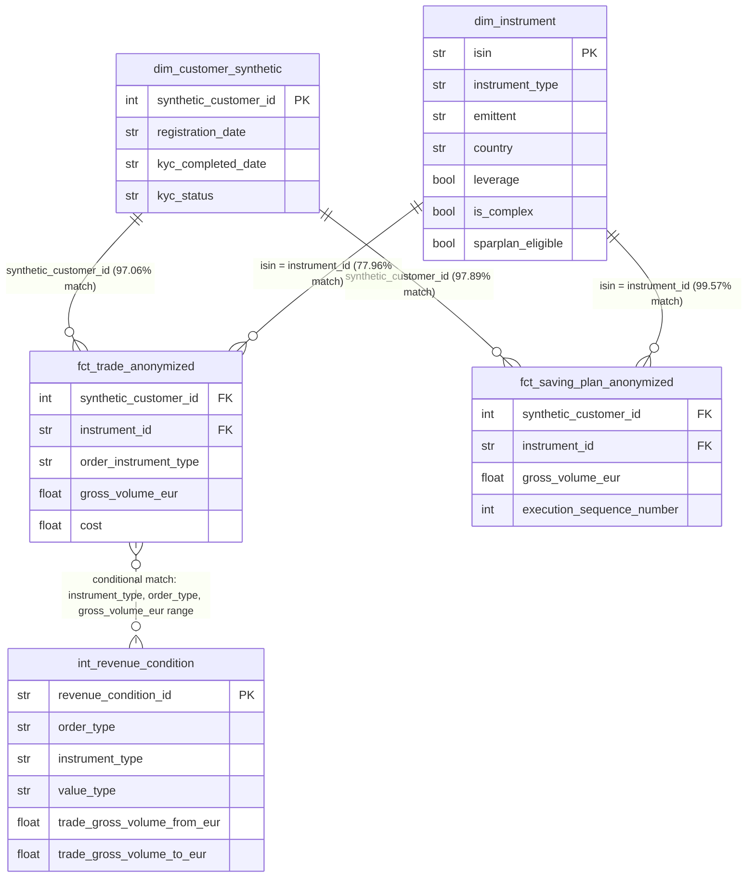

# Broker Analytics Case Study

Data analyst case study analyzing trading, savings plan, and revenue data
for a German broker. Covers data quality, revenue analysis, customer
behavior, and strategic recommendations.

## Repository Structure

- `notebooks/` — analysis notebooks, one per case study section
- `src/` — reusable functions (revenue calculation logic, data quality checks)
- `data/` — source CSVs (not committed — see note below)
- `reports/figures/` — exported charts

**Note on data:** source CSVs are excluded from this repository. Place
them in `data/` locally to reproduce the analysis.

**Note on formatting:** every question below follows the same pattern —
a one-line **Answer**, then the supporting evidence, then a **Finding**
with the full reasoning/caveats. Skim the Answers for the headline result;
read the Findings for how it was verified.

## Teil 1: Data Exploration & Data Quality

**Scale:** 29,093 customers · 100,775 trades · 39,459 saving plan executions

### Data Quality Findings

**Answer:** 3 material issues found — orphaned instrument references
(22.04% of trades), orphaned customer references (~2.9%), and exact
duplicate rows (5.04% trades / 8.04% saving plans). None dropped silently.

| # | Issue | Scope | Root Cause | Handling |
|---|---|---|---|---|
| 1 | Orphaned instrument references | 22.04% of trades unmatched to `dim_instrument` | Master data gap specific to trade-only (non-Sparplan) instruments, not a general completeness issue | Bucketed as "Unknown" in Teil 2, not dropped |
| 2 | Orphaned customer references | 2.94% of trades, 2.11% of saving plans | Likely anonymization/ID-mapping artifact (dataset is synthetic) | Excluded from customer-level analysis, exclusion rate disclosed |
| 3 | Duplicate rows | 5.04% of trades, 8.04% of saving plans are exact duplicates | ETL/export artifact (likely overlapping-batch extraction) | `drop_duplicates()` applied before all aggregation |

Full investigation and evidence for each finding: [`notebooks/01_data_exploration.py`](notebooks/01_data_exploration.py)

*(Note: from Teil 2 onward, percentages are recalculated on the de-duplicated dataset, so the instrument-orphan rate shifts slightly, e.g. 22.04% raw → 22.82% de-duplicated — same underlying gap, different denominator, not a contradiction.)*

### Entity Relationships

**Answer:** all fact tables join to their dimensions on a simple key
except `int_revenue_condition`, which has no foreign key at all — it's
matched conditionally (see diagram note below).

`int_revenue_condition` has no direct foreign key to the fact tables — it's
matched conditionally by `instrument_type`, `order_type`, and a
`gross_volume_eur` range check, applied per-trade in Teil 2.

## Teil 2: Revenue-Analyse

Code: [`notebooks/02_revenue_analysis.py`](notebooks/02_revenue_analysis.py) · rule-matching/pricing logic: [`src/revenue_engine.py`](src/revenue_engine.py)

Trades carry no revenue figure directly — it is reconstructed by matching
each trade against the pricing rules in `int_revenue_condition.csv`, then
aggregated by instrument type, issuer, platform, and customer segment.
Builds directly on Teil 1: duplicate rows are dropped and orphaned customer
IDs excluded from customer-level analysis, using the same logic established
there.

**Scale:** 95,692 de-duplicated trades · 50% priced · EUR 43,685.40 total
computed revenue (lower bound — see coverage gaps below)

### Revenue Engine — Coverage & Assumptions

**Answer:** 5 key decisions drive the engine (scope, issuer-matching
rule, masked-ISIN handling, rule-priority tiering, unmatched-trade
handling) — all documented and quantified below rather than left implicit.

| # | Decision | Detail | Handling |
|---|---|---|---|
| 1 | Scope | Only `order_type == 'TRADE'`; Sparplan/AUM conditions use the same rulebook but are out of scope here | Filtered before matching |
| 2 | Issuer matching | `emittent` is only populated for DERIVAT/ETF (0% for AKTIE/FONDS/KRYPTO — structural, confirmed not a data bug) | DERIVAT/ETF matched on `instrument_type` + issuer; AKTIE/FONDS on `instrument_type` only; KRYPTO has no `TRADE` rules → always unmatched |
| 3 | Masked ISINs | ~830 derivative/ETF ISINs use an anonymization placeholder pattern, causing 112 ISINs to collide multiple products onto one code | Modal emittent taken as best effort; checked directly — none of the 112 ambiguous ISINs were actually traded, so risk is disclosed but not material |
| 4 | Rule priority | Multiple rules can match one trade (specific volume band, staffel band, or generic) | Priority: trade-volume band > staffel band (approximated with the trade's own volume — true cumulative tracking is flagged as future work) > generic catch-all; ties broken by most recent `valid_from` |
| 5 | Unmatched trades | 21,834 trades have no instrument match; a further 26,984 matched an instrument but no rule applied | Both counted and reported separately, never silently dropped |

Full investigation and evidence: [`notebooks/02_revenue_analysis.py`](notebooks/02_revenue_analysis.py)

**Finding (sanity check):** the pre-existing `cost` column correlates only
weakly with computed `revenue_eur` (r=0.20) and is tightly distributed
around ~EUR 0.51 regardless of trade size — consistent with `cost`
representing the broker's own flat execution/clearing cost, not
customer-facing revenue. Confirms `revenue_eur` measures a distinct,
correct concept.

### Q6 — Revenue by Instrument Type

**Answer:** AKTIE leads at EUR 26,522.63, but this reflects rulebook
*coverage*, not profitability — DERIVAT revenue (EUR 14.90) is
artificially suppressed by a real pricing gap (see Finding).

| Type | Revenue | Trades priced | Avg/trade |
|---|---|---|---|
| AKTIE | EUR 26,522.63 | 31,795 | EUR 0.83 |
| FONDS | EUR 14,814.84 | 10,596 | EUR 1.40 |
| ETF | EUR 2,333.03 | 4,469 | EUR 0.52 |
| DERIVAT | EUR 14.90 | 14 | EUR 1.06 |
| KRYPTO | EUR 0.00 | 0 | — (no `TRADE` rule exists) |

**Finding:** AKTIE/FONDS dominate because the rulebook has ~99% coverage
there, not because they're inherently more profitable per trade.
**DERIVAT coverage gap, investigated:** Rhea Invest accounts for 9,658 of
11,344 DERIVAT trades (85%), but its only rule requires
`gross_volume_eur >= 9,502.40`. Its median trade is EUR 788.16 — only
0.04% of its trades clear that threshold. A genuine pricing-coverage gap
for the dominant derivative issuer, not a matching bug.

### Q7 — Top 5 Issuers by Revenue

**Answer:** Nexus Derivatives (EUR 1,728.77), Elysium Finance (EUR
496.28), Fenrir Structured (EUR 103.80), Zenith Securities (EUR 15.94),
Gaia Derivatives (EUR 3.96) — see Finding for why this ranking is
misleading if read at face value.

**Finding:** the top issuer is an ETF issuer, not DERIVAT — consistent
with the Q6 coverage gap. This ranking reflects rulebook coverage as much
as commercial value; it should not be read as "most valuable issuer."

### Q8 — Avg Revenue per Trade by Platform

**Answer:** Android App (EUR 1.05) > Web (EUR 1.00) > iOS App (EUR 0.91)
> Unknown (EUR 0.83) > Web/Mac browser (EUR 0.73).

**Finding:** fairly tight spread across platforms — platform is not a
strong revenue driver on its own.

### Q9 — Customer Segments

**Answer:** 5 segments defined by priority-assigned, data-driven
thresholds; **High-Volume/Power Traders** is the most profitable segment
on both a mean and median basis.

Segmentation uses the full de-duplicated trade set, excluding the 2.95% of
trades with an orphaned customer ID (per Teil 1 DQ Issue #2). Profitability
measured on the priced subset.

| # | Segment | Rule | Customers | Mean rev./customer | Median rev./customer |
|---|---|---|---|---|---|
| 1 | One-Time Traders | exactly 1 trade | 4,007 | EUR 0.45 | EUR 0.00 |
| 2 | **High-Volume / Power Traders** | total volume ≥ P95 | 1,352 | **EUR 2.99** | **EUR 2.37** |
| 3 | Derivative-Focused Traders | ≥30% of trades are DERIVAT | 4,359 | EUR 0.93 | EUR 0.48 |
| 4 | Buy-and-Hold / Core Investors | ≤ median trade count, low derivative share | 8,523 | EUR 1.24 | EUR 0.93 |
| 5 | Regular Active Traders | everyone else | 9,559 | EUR 2.29 | EUR 2.11 |

**Finding:** High-Volume/Power Traders lead on both a mean and median
basis (~2.5x the next-best segment). Median confirms this isn't a pure
outlier effect, despite this segment containing the single largest trade
in the dataset (~EUR 98.6M, likely institutional).

**Caveat:** One-Time Traders show ~EUR 0 median revenue partly because many
of their trades fall into the DERIVAT coverage gap (Q6) — "least
profitable" here is confounded with "least priceable," not a clean
behavioral finding on its own.

## Teil 3: Kundenverhalten & Lifecycle

Code: [`notebooks/03_customer_lifecycle.py`](notebooks/03_customer_lifecycle.py)

Shifts focus from revenue to who these customers are and how they behave
over time. Carries forward Teil 1 handling: duplicates dropped, orphaned
customer IDs excluded.

### Q10 — Distribution of Trades per Customer

**Answer:** Not a power law, despite an initial skewness statistic (95.2)
that looked like one — a single anomalous customer was driving it.

| Check | Result |
|---|---|
| Skewness, all customers | 95.2 |
| Skewness, excluding the single largest customer | **0.77** |
| Largest customer's trade count vs. next-highest | 431 vs. 13 |

**Finding:** the extreme skew comes almost entirely from **one** record —
a customer with 431 trades (all in a single instrument, across 138 days),
vs. a genuine next-highest of only 13. Excluding it, skewness collapses to
0.77: a mild right skew, not a power law. The histogram itself **peaks at
3 trades**, not at 1 — a true power-law shape would be monotonically
decreasing from the minimum, so this is unimodal count data
(Poisson/negative-binomial-like), not a heavy-tailed process. Top 20% of
customers generate ~36% of trades — a real but moderate concentration.

The outlier customer trades a single instrument over 2 years in sporadic
bursts — consistent with either a genuinely obsessive single-instrument
trader, or an anonymization/ID-collision artifact (the same class of issue
found with masked ISINs in Teil 2). Disclosed as an open question, not
resolved.

Chart: [`reports/figures/q10_trades_per_customer_distribution.png`](reports/figures/q10_trades_per_customer_distribution.png)

### Q11 — Customer Lifecycle: Registration to First Trade

**Answer:** Not reliably computable — 17.5% of customers show a first
trade *before* their recorded registration date, a logical impossibility.

| Check | Result |
|---|---|
| Customers with no `registration_date` | 1,456 |
| Registered but never traded | 1,232 / 27,637 |
| First trade recorded **before** registration (impossible) | 4,629 / 26,405 (17.5%) |
| Median days to first trade, valid subset only | 1,043 days (~2.9 years) |

**Finding:** ruled out bulk-import artifacts as the cause (2,556 distinct
registration dates, ~11 customers/date, no clustering). Even on the
"valid" subset, the median gap of ~2.9 years is implausibly long for a
real activation funnel. Most likely explanation: `registration_date`
isn't reliably consistent with trade timestamps in this synthetic
dataset — flagged as an open question for whoever owns onboarding data,
not presented as a confident funnel metric.

Chart: [`reports/figures/q11_activation_lifecycle.png`](reports/figures/q11_activation_lifecycle.png)

### Q12 — Data Quality: KYC Timestamps

**Answer:** 2 real issues found (missing completion dates, impossible
date ordering) — both handled explicitly, not silently corrected.

| # | Issue | Scope | Handling |
|---|---|---|---|
| 1 | `completed` status with no `kyc_completed_date` | 724 customers | Treated as unknown/not computable, never imputed |
| 2 | `kyc_completed_date` before `registration_date` | 475 / 24,770 (1.9%) | Excluded from any days-based KYC metric |
| 3 | `rejected` customers all have a `kyc_completed_date` | 2,101 customers | Re-interpreted as "date decision was finalized," not "date KYC succeeded" — `kyc_status` used alongside, never inferred from the date alone |

**Finding:** after applying this handling, "days to KYC completion" on
the clean subset looks completely legitimate (median 2 days, max 30
days) — a useful contrast with Q11, showing `registration_date` isn't
broadly unreliable, just specifically inconsistent with *trade*
timestamps.

### Q13 — Temporal Trading Patterns

**Answer:** two different-looking spikes in the data, one is noise and
one is real — verified separately rather than assumed to be the same
kind of thing.

| Pattern | Verdict |
|---|---|
| Weekend trading share: 28.6% (≈ uniform-random baseline of 2/7) | **Noise** — identical share across AKTIE/DERIVAT/KRYPTO, despite stock/derivative exchanges being closed on weekends in reality |
| 17:00 hour spike: ~24% of ETF/FONDS trades vs. 2.7-4.4% for other types | **Real** — consistent with genuine end-of-day NAV ("Net Asset Value") pricing cutoffs used by many European funds/ETFs |

**Finding:** the same raw signal (a spike in a histogram) turned out to
be noise in one case and a genuine, business-explainable pattern in the
other — verified by breaking both down by instrument type rather than
accepting either at face value.

Chart: [`reports/figures/q13_temporal_patterns.png`](reports/figures/q13_temporal_patterns.png)

### Q14 — Sparplan vs. Trade Activity Relationship

**Answer:** no relationship. Sparplan customers trade at essentially the
same rate as everyone else.

| Group | Mean trades | Median trades |
|---|---|---|
| Has a Sparplan | 3.22 | 3.0 |
| No Sparplan | 3.17 | 3.0 |

Correlation between Sparplan execution count and trade count, among
customers active in both (n=11,763): **0.008**.

**Finding:** Sparplan and active trading appear to serve distinct
customer needs rather than one leading to the other. Relevant for Teil 5:
don't assume Sparplan customers are a natural upsell funnel into active
trading based on this data alone.

## Teil 4: Sparplan Deep Dive

Code: [`notebooks/04_sparplan_deep_dive.py`](notebooks/04_sparplan_deep_dive.py)

Recurring investors matter commercially because they're typically
stickier, more predictable revenue than one-off traders (Teil 2 Q9).
Carries forward Teil 1 handling (8.04% duplicate rows dropped, matching
the Teil 1 finding exactly).

*(Numbering note: the source PDF labels these questions 14, 15, 16 —
reusing "14," which was also the last question number in Teil 3. This
looks like a restart-per-section rather than a true error: Teil 5's own
questions are printed as 17/18, which only makes arithmetic sense if
Teil 4 ends at 16. So the numbers below match the PDF exactly; the "14"
below is a different question from Teil 3's Q14, distinguished by
section rather than by number.)*

### Q14 — Active Sparplans (≥2 executions for the same customer + instrument)

**Answer:** only 11.2% of Sparplan starts are ever "active" (≥2
executions) — checked and confirmed this is real customer behavior, not
a measurement artifact.

| Metric | Value |
|---|---|
| Total customer+instrument series | 15,994 |
| Active (≥2 executions) | 1,798 (11.2%) |
| One-time only | 14,196 (88.8%) |

**Finding:** checked two more mundane explanations before accepting this
at face value:

- **Right-censoring** (not enough time elapsed yet): ruled out — median
  "days since first execution" is identical (282 days) for one-time and
  active series.
- **Definition too narrow** (customer reallocates across instruments each
  cycle): ruled out — of customers where no single instrument repeated,
  only 22.7% even tried a second, different instrument.

**Conclusion:** a genuine behavioral finding — most attempted Sparplans
are abandoned after one installment. Worth escalating as a
product/onboarding question.

Chart: [`reports/figures/q16_sparplan_execution_frequency.png`](reports/figures/q16_sparplan_execution_frequency.png)

### Q15 — Average Amount & Interval

**Answer:** median installment is EUR 1.45 (mathematically sound, but
worth verifying against source system); typical interval clusters around
weekly/biweekly/monthly (7 / 14-17 / 28-32 days).

Median installment size is EUR 1.45 (mean EUR 49.75, extreme right skew).
The math checks out (quantity × price = volume, no calculation bug;
verified against fractional share examples), but this is well below
typical real-world Sparplan minimums (EUR 25-50/month) — flagged as worth
verifying against the source system.

Excluding structurally-zero first executions, the most common intervals
cluster at 7 (weekly), 14-17 (biweekly), and 28-32 (monthly) days —
consistent with genuine recurring cadences.

**Finding (important data-quality discovery made during this
investigation):** 99.4% of active series have **every execution stamped
with the same `date_id`**, and 89.4% also share an identical `exec_price`
across all executions — regardless of `execution_sequence_number`. This
means `date_id` in this table behaves like a snapshot/export date
attached to the whole plan, not a genuine per-installment timestamp.

**Consequence:** `execution_sequence_number` and `inter_val` (the plan's
configured cadence) remain usable, but any metric computed from
individual-execution dates (e.g. "days since last execution") is **not
reliable** and is not reported as such below.

### Q16 — Execution Sequence Gaps

**Answer:** 20.4% of active Sparplans have at least one gap in their
sequence numbers — real and confirmed, but we can no longer say what it
predicts (see Finding).

| Metric | Value |
|---|---|
| Active Sparplans with ≥1 gap in `execution_sequence_number` | 367 / 1,798 (20.4%) |
| Median missing numbers, among series with a gap | 4 |

**Finding:** e.g. sequence 1, 2, 3, 4, 9 skipping 5-8 entirely. This part
is solid, since it only depends on the sequence numbers themselves, not
on the unreliable date field found in Q15.

**What we can't confirm:** an earlier pass of this analysis claimed gaps
predict eventual plan dormancy (via "days since last execution"). That
claim relied on the same `date_id` field just shown to be a snapshot
artifact, not a real timestamp — it has been **retracted** rather than
left in with false confidence. Testing whether gaps actually predict
abandonment would need a genuinely reliable per-installment date, which
is flagged as a data request rather than answered with invented
precision.