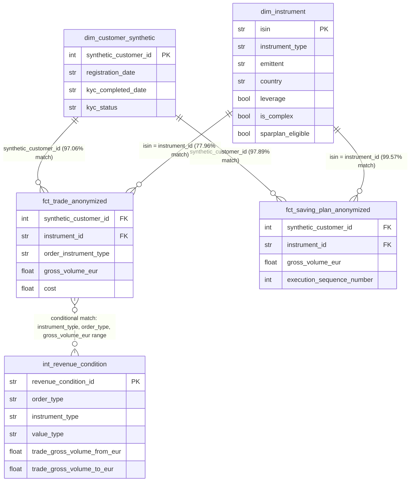

# Broker Analytics Case Study

Data analyst case study analyzing trading, savings plan, and revenue data
for a German broker. Covers data quality, revenue analysis, customer
behavior, and strategic recommendations.

## Repository Structure

- `notebooks/` — analysis notebooks, one per case study section
- `src/` — reusable functions (revenue calculation logic, data quality checks)
- `data/` — source CSVs (not committed — see note below)
- `reports/figures/` — exported charts

**Note on data:** source CSVs are excluded from this repository. Place
them in `data/` locally to reproduce the analysis.

## Teil 1: Data Exploration & Data Quality

**Scale:** 29,093 customers · 100,775 trades · 39,459 saving plan executions

### Data Quality Findings

| # | Issue | Scope | Root Cause | Handling |
|---|---|---|---|---|
| 1 | Orphaned instrument references | 22.04% of trades unmatched to `dim_instrument` | Master data gap specific to trade-only (non-Sparplan) instruments, not a general completeness issue | Bucketed as "Unknown" in Teil 2, not dropped |
| 2 | Orphaned customer references | 2.94% of trades, 2.11% of saving plans | Likely anonymization/ID-mapping artifact (dataset is synthetic) | Excluded from customer-level analysis, exclusion rate disclosed |
| 3 | Duplicate rows | 5.04% of trades, 8.04% of saving plans are exact duplicates | ETL/export artifact (likely overlapping-batch extraction) | `drop_duplicates()` applied before all aggregation |

Full investigation and evidence for each finding: [`notebooks/01_data_exploration.py`](notebooks/01_data_exploration.py)

### Entity Relationships

`int_revenue_condition` has no direct foreign key to the fact tables — it's
matched conditionally by `instrument_type`, `order_type`, and a
`gross_volume_eur` range check, applied per-trade in Teil 2.

## Teil 2: Revenue-Analyse

Code: [`notebooks/02_revenue_analysis.py`](./notebooks/02_revenue_analysis.py) · rule-matching/pricing logic: [`src/revenue_engine.py`](./src/revenue_engine.py)

Trades carry no revenue figure directly — it is reconstructed by matching
each trade against the pricing rules in `int_revenue_condition.csv`, then
aggregated by instrument type, issuer, platform, and customer segment.
Builds directly on Teil 1: duplicate rows are dropped and orphaned customer
IDs excluded from customer-level analysis, using the same logic established
there.

**Scale:** 95,692 de-duplicated trades · 50% priced · EUR 43,685.40 total
computed revenue (lower bound — see coverage gaps below)

### Revenue Engine — Coverage & Assumptions

[#revenue-engine--coverage--assumptions](#revenue-engine--coverage--assumptions)

| # | Decision | Detail | Handling |
| --- | --- | --- | --- |
| 1 | Scope | Only `order_type == 'TRADE'`; Sparplan/AUM conditions use the same rulebook but are out of scope here | Filtered before matching |
| 2 | Issuer matching | `emittent` is only populated for DERIVAT/ETF (0% for AKTIE/FONDS/KRYPTO — structural, confirmed not a data bug) | DERIVAT/ETF matched on `instrument_type` + issuer; AKTIE/FONDS on `instrument_type` only; KRYPTO has no `TRADE` rules → always unmatched |
| 3 | Masked ISINs | ~830 derivative/ETF ISINs use an anonymization placeholder pattern, causing 112 ISINs to collide multiple products onto one code | Modal emittent taken as best effort; checked directly — none of the 112 ambiguous ISINs were actually traded, so risk is disclosed but not material |
| 4 | Rule priority | Multiple rules can match one trade (specific volume band, staffel band, or generic) | Priority: trade-volume band > staffel band (approximated with the trade's own volume — true cumulative tracking is flagged as future work) > generic catch-all; ties broken by most recent `valid_from` |
| 5 | Unmatched trades | 21,834 trades have no instrument match; a further 26,984 matched an instrument but no rule applied | Both counted and reported separately, never silently dropped |

Full investigation and evidence: [`notebooks/02_revenue_analysis.py`](./notebooks/02_revenue_analysis.py)

**Sanity check:** the pre-existing `cost` column correlates only weakly
with computed `revenue_eur` (r=0.20) and is tightly distributed around
~EUR 0.51 regardless of trade size — consistent with `cost` representing
the broker's own flat execution/clearing cost, not customer-facing
revenue. Confirms `revenue_eur` measures a distinct, correct concept.

### Q6 — Revenue by Instrument Type

[#q6--revenue-by-instrument-type](#q6--revenue-by-instrument-type)

| Type | Revenue | Trades priced | Avg/trade |
| --- | --- | --- | --- |
| AKTIE | EUR 26,522.63 | 31,795 | EUR 0.83 |
| FONDS | EUR 14,814.84 | 10,596 | EUR 1.40 |
| ETF | EUR 2,333.03 | 4,469 | EUR 0.52 |
| DERIVAT | EUR 14.90 | 14 | EUR 1.06 |
| KRYPTO | EUR 0.00 | 0 | — (no `TRADE` rule exists) |

AKTIE/FONDS dominate because the rulebook has ~99% coverage there, not
because they're inherently more profitable per trade.

**DERIVAT coverage gap, investigated:** Rhea Invest accounts for 9,658 of
11,344 DERIVAT trades (85%), but its only rule requires
`gross_volume_eur >= 9,502.40`. Its median trade is EUR 788.16 — only
0.04% of its trades clear that threshold. A genuine pricing-coverage gap
for the dominant derivative issuer, not a matching bug.

### Q7 — Top 5 Issuers by Revenue

[#q7--top-5-issuers-by-revenue](#q7--top-5-issuers-by-revenue)

Nexus Derivatives (EUR 1,728.77) · Elysium Finance (EUR 496.28) · Fenrir
Structured (EUR 103.80) · Zenith Securities (EUR 15.94) · Gaia Derivatives
(EUR 3.96)

Top issuer is an ETF issuer, not DERIVAT — consistent with the coverage
gap above. This ranking reflects rulebook coverage as much as commercial
value; it should not be read as "most valuable issuer."

### Q8 — Avg Revenue per Trade by Platform

[#q8--avg-revenue-per-trade-by-platform](#q8--avg-revenue-per-trade-by-platform)

Android App (EUR 1.05) > Web (EUR 1.00) > iOS App (EUR 0.91) > Unknown
(EUR 0.83) > Web/Mac browser (EUR 0.73). Fairly tight spread — platform is
not a strong revenue driver on its own.

### Q9 — Customer Segments

[#q9--customer-segments](#q9--customer-segments)

Segmentation uses the full de-duplicated trade set, excluding the 2.95% of
trades with an orphaned customer ID (per Teil 1 DQ Issue #2). Profitability
measured on the priced subset. Priority-assigned, mutually exclusive,
data-driven thresholds.

| # | Segment | Rule | Customers | Mean rev./customer | Median rev./customer |
| --- | --- | --- | --- | --- | --- |
| 1 | One-Time Traders | exactly 1 trade | 4,007 | EUR 0.45 | EUR 0.00 |
| 2 | **High-Volume / Power Traders** | total volume ≥ P95 | 1,352 | **EUR 2.99** | **EUR 2.37** |
| 3 | Derivative-Focused Traders | ≥30% of trades are DERIVAT | 4,359 | EUR 0.93 | EUR 0.48 |
| 4 | Buy-and-Hold / Core Investors | ≤ median trade count, low derivative share | 8,523 | EUR 1.24 | EUR 0.93 |
| 5 | Regular Active Traders | everyone else | 9,559 | EUR 2.29 | EUR 2.11 |

**Most profitable segment: High-Volume/Power Traders** — highest on both a
mean and median basis (~2.5x the next-best segment). Median confirms this
isn't a pure outlier effect, despite this segment containing the single
largest trade in the dataset (~EUR 98.6M, likely institutional).

**Caveat:** One-Time Traders show ~EUR 0 median revenue partly because many
of their trades fall into the DERIVAT coverage gap (Q6) — "least
profitable" here is confounded with "least priceable," not a clean
behavioral finding on its own.