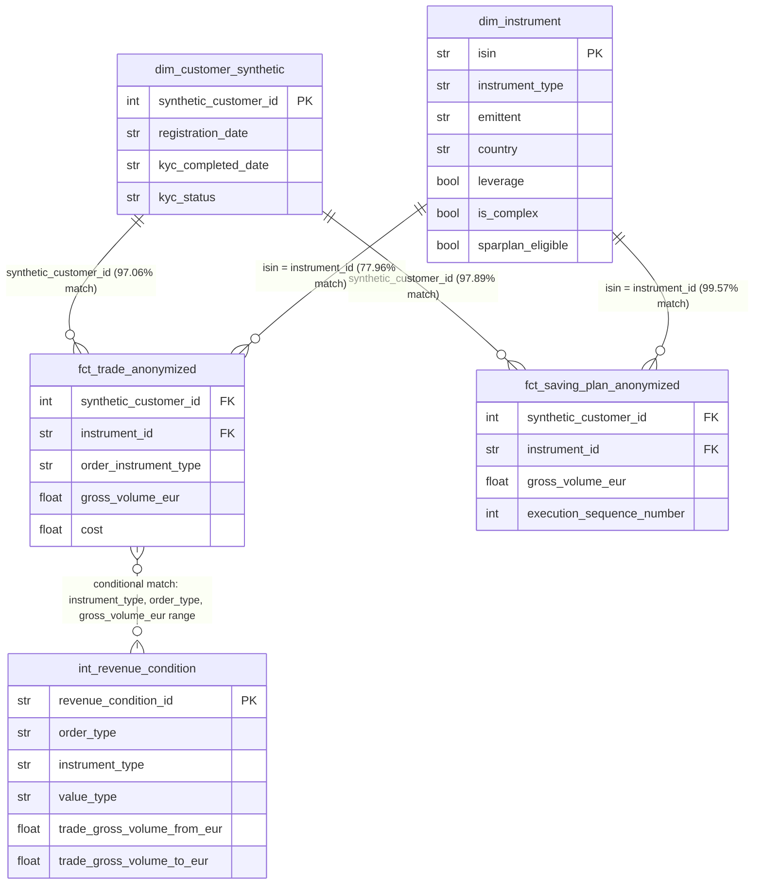

# Broker Analytics Case Study

Data analyst case study analyzing trading, savings plan, and revenue data
for a German broker. Covers data quality, revenue analysis, customer
behavior, and strategic recommendations.

## Repository Structure

- `notebooks/` — analysis notebooks, one per case study section
- `src/` — reusable functions (revenue calculation logic, data quality checks)
- `data/` — source CSVs (not committed — see note below)
- `reports/figures/` — exported charts

**Note on data:** source CSVs are excluded from this repository. Place
them in `data/` locally to reproduce the analysis.

## Teil 1: Data Exploration & Data Quality

**Scale:** 29,093 customers · 100,775 trades · 39,459 saving plan executions

### Data Quality Findings

| # | Issue | Scope | Root Cause | Handling |
|---|---|---|---|---|
| 1 | Orphaned instrument references | 22.04% of trades unmatched to `dim_instrument` | Master data gap specific to trade-only (non-Sparplan) instruments, not a general completeness issue | Bucketed as "Unknown" in Teil 2, not dropped |
| 2 | Orphaned customer references | 2.94% of trades, 2.11% of saving plans | Likely anonymization/ID-mapping artifact (dataset is synthetic) | Excluded from customer-level analysis, exclusion rate disclosed |
| 3 | Duplicate rows | 5.04% of trades, 8.04% of saving plans are exact duplicates | ETL/export artifact (likely overlapping-batch extraction) | `drop_duplicates()` applied before all aggregation |

Full investigation and evidence for each finding: [`notebooks/01_data_exploration.py`](notebooks/01_data_exploration.py)

### Entity Relationships

`int_revenue_condition` has no direct foreign key to the fact tables — it's
matched conditionally by `instrument_type`, `order_type`, and a
`gross_volume_eur` range check, applied per-trade in Teil 2.